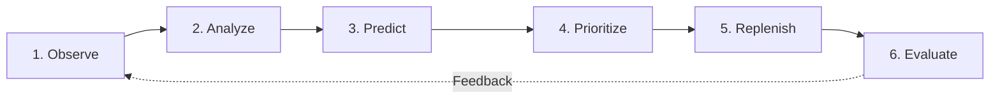

# 🏧 ATM Cash Management Decision Support System (DSS)

[](https://www.python.org/)
[](https://streamlit.io/)
[](https://xgboost.readthedocs.io/)
[](https://plotly.com/)
[](LICENSE)

An interactive, production-grade **Decision Support System (DSS)** developed in **Streamlit** for bank ATM cash management operations. This system bridges predictive machine learning models, time series feature engineering, and empirical policy simulation to solve the classic cash inventory trade-off: **minimizing cash stockout risk while controlling armored courier transport and cash holding costs**.

---

## 📌 Executive Summary & Problem Context

Bank treasury and cash logistics managers face a daily challenge:
- **Cash Depletions (Stockouts):** Lead to customer dissatisfaction, brand degradation, and lost interchange revenue.
- **Excessive Cash Buffers:** Incur high idle capital holding costs and security risks.
- **Logistical Constraints:** Armored car couriers (Cash-in-Transit / CIT) have finite daily servicing capacity ($N$ ATMs per fleet route).

Rather than relying on static calendar-based refill cycles or fragile point forecasts, this DSS operationalizes **probabilistic risk ranking (XGBoost classifiers)** coupled with **Top-$N$ constrained capacity replenishment planning** and **empirical backtesting**.

---

## 🔄 The 6-Stage Operational Lifecycle



1. **Observe (Executive Dashboard & Network Monitor):** Real-time surveillance of 60 ATMs across 10 metropolitan regions, geospatial tracking, and cash capacity utilization.
2. **Analyze (Demand & Seasonality Analytics):** Diagnostic exploration of calendar effects, salary cycle demand surges (Days 1–3), weekend spikes, and holiday velocity.
3. **Predict (Risk & Urgency Classification):** XGBoost models estimating 1-day stockout urgency and 3-day probabilistic depletion risk.
4. **Prioritize (Constrained Dispatch Manifest):** Intelligent Top-$N$ ranking to allocate finite CIT armored courier slots to highest-risk machines.
5. **Replenish (Refill Sizing Calculator):** Dynamic cash injection sizing based on the 90% capacity rule with rolling 7-day demand sanity checks.
6. **Evaluate (Policy Simulator & Benchmarks):** 59-day out-of-sample backtesting comparing fixed rotational schedules against model-driven dispatch under varying fleet capacities ($N = 5 \dots 16$).

---

## 🖥️ Application Architecture & Multi-Page Modules

The system is organized into a modular multi-page Streamlit application:

```
ATM_Cash_Prediction/
├── app.py                          # Primary application entry point & router
│
├── pages/
│   ├── 01_Executive_Dashboard.py   # Operations Command Center, Fleet KPIs & Geospatial Risk Map
│   ├── 02_ATM_Network.py           # Fleet Directory, Interactive Filtering & Individual Drill-down
│   ├── 03_Demand_Analytics.py      # Time Series Diagnostics, Payday Spikes, DoW & Holiday Analysis
│   ├── 04_Risk_Alerts.py           # Early Warning Matrix, Urgency Scatter & Risk Distribution
│   ├── 05_Replenishment_Planner.py # Top-N Courier Dispatch Manifest & Refill Sizing Calculator
│   ├── 06_Model_Performance.py     # Forecasting Benchmarks, ROC-AUC / PR-AUC & Feature Gain
│   └── 07_Policy_Simulator.py      # 59-Day Empirical Policy Backtesting (Fixed vs Model-driven)
│
├── utils/
│   ├── styling.py                  # Financial enterprise theme, badges, cards & Plotly templates
│   ├── data_loader.py              # Cached data ingestion, feature enrichment & global sidebar
│   ├── models_engine.py            # XGBoost model loaders, inference pipeline & baseline metrics
│   ├── replenishment_engine.py     # Cash refill sizing (90% capacity target) & sanity validations
│   └── simulation_engine.py        # 59-day backtesting simulation engine across capacity N
│
├── data/
│   └── atm_metadata.csv            # 60 ATM metadata records (lat, lon, city, location type, capacity)
│
├── models/
│   ├── low_cash_next_1d_xgb.json   # Trained 1-day stockout urgency classifier (XGBoost)
│   ├── low_cash_next_3d_xgb.json   # Trained 3-day horizon risk classifier (XGBoost)
│   ├── forecasting_xgb.json        # Pooled demand regressor (XGBoost)
│   └── model_metadata.json         # Label encoders, feature schemas, and training cutoff dates
│
├── ATM_Phase3_EDA (9).ipynb         # Comprehensive research, EDA, feature engineering & model training
├── requirements.txt                # Curated Python dependencies
├── .gitignore                      # Git ignore patterns for clean development
└── README.md                       # System documentation and operational guide
```

---

## 🧠 Machine Learning Models & Engineering

### 1. Model Architecture
- **1-Day Urgency Classifier (`low_cash_next_1d_xgb.json`):**
  - **Target:** Binary flag indicating if end-of-day cash drops below 20% capacity on $T+1$.
  - **Operational Role:** Identifies immediate, critical stockout emergencies for same-day/next-day dispatch.
- **3-Day Priority Classifier (`low_cash_next_3d_xgb.json`):**
  - **Target:** Probability that cash drops below critical threshold at any point over the next 3 days ($T+1 \dots T+3$).
  - **Operational Role:** Enables multi-day planning and proactive courier scheduling before depletions occur.
- **Demand Regressor (`forecasting_xgb.json`):**
  - **Target:** Daily total withdrawal amount ($\text{INR } ₹$) per ATM.
  - **Operational Role:** Baseline demand signal used to estimate replenishment injection volumes.

### 2. Feature Schema
| Feature Group | Variables | Description |
| :--- | :--- | :--- |
| **Current State** | `pct_capacity_eod`, `days_since_replenishment` | Current cash level (% of max capacity) and elapsed days since last refill |
| **Historical Demand** | `withdrawal_lag_1d`, `withdrawal_lag_7d`, `withdrawal_roll7_mean` | Prior day withdrawal, weekly seasonal lag, and 7-day rolling average demand |
| **Calendar Drivers** | `is_weekend`, `is_holiday`, `day_of_month` | Weekend flags, bank holidays, and day-of-month (capturing salary spikes on days 1–3) |
| **Entity Encodings** | `atm_id_code`, `loc_code`, `city_code` | Categorical label encodings for ATM identity, location type (Urban, Semi-Urban, Rural), and City |

---

## 📊 Key Scientific & Empirical Findings

### 1. The Point Forecasting Ceiling ($R^2 \approx 0.30$)
- Individual ATM transaction withdrawal volume contains high idiosyncratic variance at daily resolution.
- ~80% of model $R^2$ derives from static ATM-level demand baselines rather than time-varying shocks.
- **Key Takeaway:** Operations should not rely on point forecasts alone. **Probabilistic risk classification and rank-ordered prioritization** are far more robust for dispatch decisions.

### 2. The Honest Negative Case at Tight Capacity ($N = 5$)
- Under severe courier capacity constraints ($N = 5$ visits/day across 60 ATMs):
  - Model-driven policy produces **1,849 low-cash days vs 1,712 for a fixed schedule (-8.0% deficit)**.
  - *Mechanism:* Greedy risk-ranking repeatedly services high-volume urban ATMs, inadvertently starving moderate-volume machines as they slowly drain. A round-robin fixed rotation guarantees eventual coverage.
  - *Recommendation:* Deploy a **hybrid scheduling policy** under severe fleet bottlenecks ($N \le 6$).

### 3. Dominant Performance at Practical Fleet Capacity ($N \ge 8$)
- When capacity is raised to standard operational levels ($N \ge 8$):
  - Model-driven dispatch dramatically outperforms fixed rotation, yielding **25% to 69% fewer stockout days** across the 59-day backtest.

---

## ⚡ Quickstart & Installation

### Prerequisites
- Python 3.10, 3.11, or 3.12
- Git

### 1. Clone the Repository
```bash
git clone <repository-url>
cd ATM_Cash_Prediction
```

### 2. Set Up a Virtual Environment
```bash
# Linux / macOS
python3 -m venv .venv
source .venv/bin/activate

# Windows (Command Prompt / PowerShell)
python -m venv .venv
.venv\Scripts\activate
```

### 3. Install Dependencies
```bash
pip install --upgrade pip
pip install -r requirements.txt
```

### 4. Launch the Streamlit DSS
```bash
streamlit run app.py
```
Open [http://localhost:8501](http://localhost:8501) in your browser.

---

## 📖 Operational User Journey

1. **Morning Briefing (`01_Executive_Dashboard`):**
   - Check overall network health, total active ATMs, and high-urgency alerts.
   - Inspect the geospatial map for regional clusters of low-cash machines.
2. **Deep Dive Diagnostics (`02_ATM_Network` & `03_Demand_Analytics`):**
   - Inspect individual ATM cash trajectories and verify if impending holidays or salary days will cause demand spikes.
3. **Dispatch Generation (`05_Replenishment_Planner`):**
   - Set the daily courier vehicle quota ($N$, default: 12).
   - Review the generated Top-$N$ prioritized dispatch manifest.
   - Inspect recommended cash refill amounts calculated to restore machines to 90% capacity.
4. **Policy Stress Testing (`07_Policy_Simulator`):**
   - Run backtests comparing your current CIT courier schedule against model-driven prioritization over 59 historical out-of-sample days.

---

## 👥 Contributors & Acknowledgements

- **Developed for:** Bank ATM Treasury and Cash-in-Transit (CIT) Operations.
- **Reference Research:** Detailed EDA, model calibration, and backtesting documented in `ATM_Phase3_EDA (9).ipynb`.
